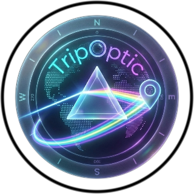
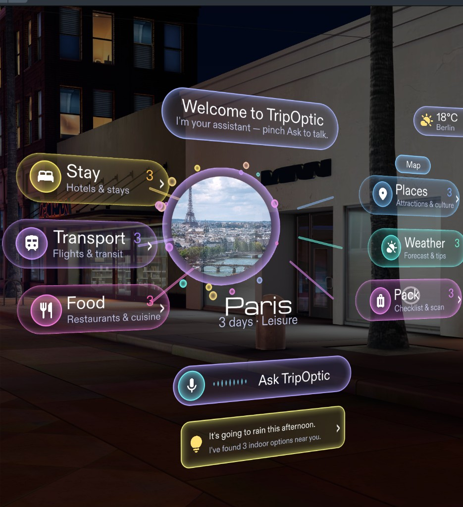
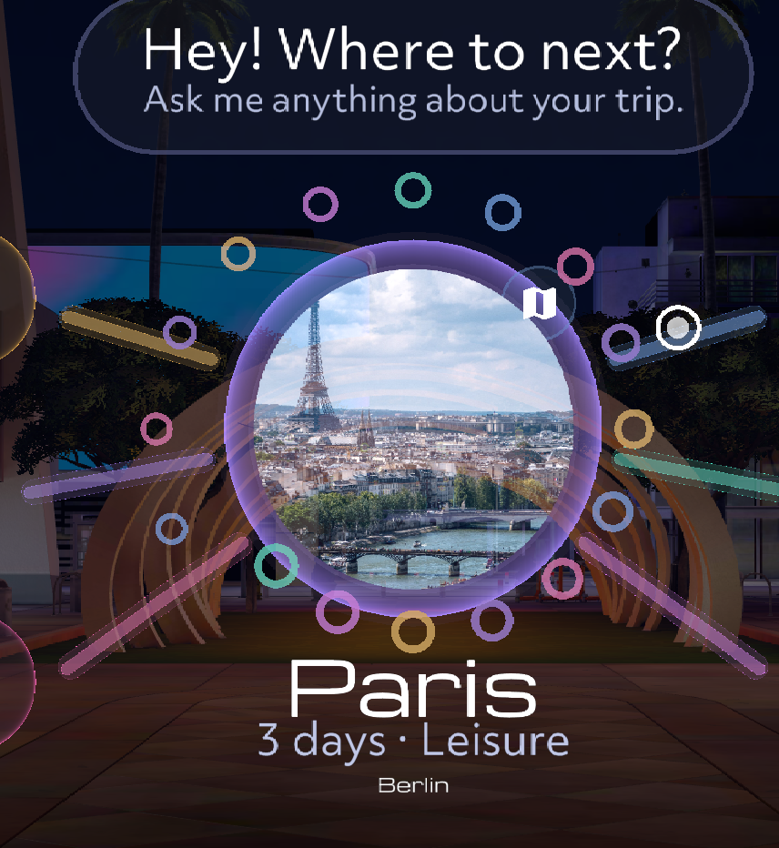
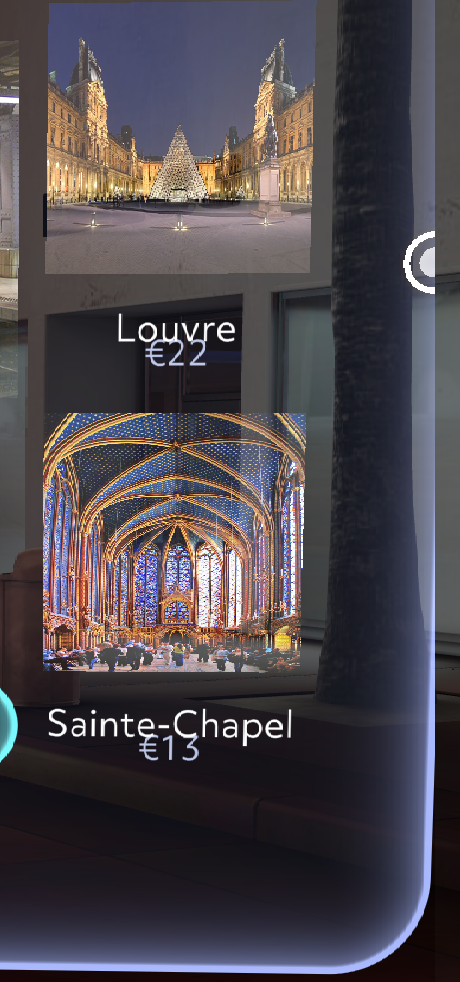

  

# TripOptic

**Voice-first trip planning on Snap Spectacles.** Speak a destination, get a structured plan in AR — hotels, transit, food, sights, weather, and what to pack — without unlocking a phone.

  

| | |
|---|---|
| **Open in Lens Studio** | `Travel_Planner.esproj` · **5.15** · Spectacles (2024) |
| **Demo** | https://youtu.be/CID8_5U6rj4 |
| **Repo** | [github.com/urbanpeppermint/travel-planner-porthole](https://github.com/urbanpeppermint/travel-planner-porthole) |
| **Challenge** | [Spectacles Community Challenges](https://lenslist.co/spectacles-community-challenges) (Open Source) |

---

## Bring your own Google Places key

Stay, Food, and Places cards work out of the box (sample data + Wikipedia / Imagen photos). Paste **your own Google Places API (New)** key on the scene object **`TripOptic_Proto`** → Inspector field **`placesApiKey`** to load live hotels, restaurants, attractions, photos, ratings, and reviews for the destination.

- Key stays in the **Lens Studio scene only**. It is never hardcoded.
- This repo ships `placesApiKey: ""`. Do not commit a filled-in key.
- Enable **Places API (New)** on that Google Cloud project. Optional: the same key can power Place Photos.

Remote Service Gateway still holds **Gemini / Imagen / optional OpenAI TTS** credentials in Lens Studio — also never in git.

---

## What it does

TripOptic walks you from **first intent** (“I’m going to Lisbon next month for work”) to a **structured trip draft** (departure, destination, dates, purpose), then requests a **single Gemini-powered trip plan** and surfaces it as **six interactive glass capsules** in AR.

  

### Core capabilities

| Area | Description |
|------|-------------|
| **Voice intake** | Hands-free capture of cities, dates, and purpose via STT, with **deterministic parsing** so common phrases map reliably to draft fields before any plan request. |
| **Keyboard path** | **AR keyboard** stepped flow (same draft as voice) when the street is too loud or you prefer typing. |
| **AI trip plan** | One-shot **Google Gemini** (`generateContent`) through **Remote Service Gateway**, aligned with typed plan cards (transport, stay, places, food, weather, pack). |
| **Glass spatial UI** | Soft neon capsules, circular destination portal, Ask bar, weather chip, and tip card — pinch to open detail panels. |
| **Bring-your-own Places** | Optional **Google Places API (New)** key → real listings, photos, stars, and reviews. Without a key: Wikipedia / Imagen still fill images. |
| **Street map** | **Snap MapModule** tiles (Spectacles native maps) with walking routes from stay (or GPS) to the day’s pins. Pinch **Start** to follow one path. |
| **Category detail** | **SIK pinch** → hero + cards, prices, **View details**, Google reviews when Places is enabled. |
| **Pack scan** | Camera frame (or editor-safe fallback) → **Gemini Vision**, informed by **live AccuWeather** when wired. |
| **Live weather** | Glassy forecast on the current city. Pinch for a **departure / stay / return** schedule. |
| **What to Pack** | Advice follows weather, **trip purpose** (leisure, business, bleisure), and whether the leg is a **flight**. |
| **Destination imagery** | Circular portal photo (Places → Wikipedia → Imagen). Optional Spatial Image inside the orb. |
| **TTS (optional)** | **OpenAI** narration when configured. |
| **Purpose modes** | **Leisure**, **Business**, and **Bleisure**. |

  

---

## Version updates

### v2 — Glass spatial UI (current)

- **Design:** SDF neon glass, circular destination portal, category capsules, Ask bar, weather chip, indoor/outdoor tips — matched to the Spectacles 5.24 look while shipping on **Lens Studio 5.15**.
- **Places:** Inspector **bring-your-own** Google Places (New) token for accurate hotels, food, sights, photos, and reviews.
- **Map:** Snap **MapModule** street map + walking preview (no third-party tile API keys).
- **Images:** Portal and cards fall back Wikipedia → Imagen when Places is empty or a photo fails.
- **Glasses:** `EXPERIMENTAL_API` on the Lens so internet + location can be granted together (enable Experimental APIs / Extended Permissions on device).
- **Voice:** Welcome greeting; Ask bar starts the same Gemini session as the old Voice Mode path.

### v1 — Planner core

- Voice + keyboard draft, one Gemini plan, six category rows, pack scan, AccuWeather, optional TTS.

---

## Who it is for

- **Business travelers** — dates and cities in one utterance, structured transport and stay options, weather-aware packing.
- **Bleisure / weekend trips** — work constraints plus leisure categories on one surface.
- **Explorers already in-market** — local-only behavior when you are already at the destination.
- **Spectacles builders** — RSG Gemini/Imagen, SIK pinch UI, optional Places key, Snap MapModule, camera → vision. See `SCENE_SETUP.md`.

---

## Why TripOptic

- **Calm orchestration** — Speech becomes a **stable draft**; Gemini runs when the draft is ready, not on every utterance.
- **Your data, your key** — Places accuracy is opt-in: paste a token in the Inspector; the open-source repo never ships secrets.
- **One plan object** — Categories share a single structured response so UI, TTS, and detail panels stay aligned.
- **Grounded packing** — Pack checks follow the trip goal, the vehicle, and weather on departure, stay, and return.
- **Voice and keyboard** — Parallel paths for noisy streets vs. quiet rooms.

---

## For Spectacles builders

| Piece | Script / pattern |
|-------|------------------|
| Trip draft + plan | `GeminiAssistant.ts` — scoped speech parse → `TripDraft` → one `generateContent` |
| Glass layout | `Assets/Scripts/TripOptic/TripOpticLayoutPrototype.ts` on **`TripOptic_Proto`** |
| Places (BYO key) | `TripOpticPlaces.ts` — Inspector `placesApiKey`; never commit |
| Snap street map | `TripOpticMap.ts` — `MapModule` + walking routes |
| Portal photo | `TripOpticPortal.ts` — Places → wiki → Imagen |
| UI bridges | `AIAssistantUIBridge.ts`, `ASRQueryController` |
| Category detail + pack HUD | `CategoryPlanDetailController.ts`, `PackScanController.ts` |
| Pack vision | `VideoController` JPEG → Gemini vision; `WeatherAccuBridge` |
| 5.15 port notes | `TRIPOPTIC_5.15_PORT.md` |

**Inspector wiring:** `Assets/Scripts/TravelPlanner/SCENE_SETUP.md`

**Credentials (all local to Lens Studio):**

1. **Remote Service Gateway** — Gemini, Imagen, optional OpenAI TTS.
2. **`TripOptic_Proto.placesApiKey`** — Google Places API (New), optional.
3. **AccuWeather** — via the Weather package remote module.

Never commit `.env`, RSG tokens, or a non-empty `placesApiKey`.

---

## Tech stack

- **Snap Lens Studio 5.15** / **Spectacles (2024)**
- **TypeScript** — `Assets/Scripts/TravelPlanner/` + `Assets/Scripts/TripOptic/`
- **Spectacles Interaction Kit (SIK) 0.15**
- **Remote Service Gateway** — Gemini, Imagen, optional OpenAI
- **Google Places API (New)** — optional, Inspector
- **MapModule** — native Snap map textures
- **AccuWeather** — `Packages/Weather - AccuWeather API.lspkg`

---

## Getting started

1. Open **`Travel_Planner.esproj`** in **Lens Studio 5.15** (do not open this project in 5.24).
2. Configure **Remote Service Gateway** for Gemini (and OpenAI if using TTS).
3. Optional: paste a **Places API (New)** key on **`TripOptic_Proto`**.
4. Follow **`Assets/Scripts/TravelPlanner/SCENE_SETUP.md`**.
5. On glasses: enable **Experimental APIs** and allow **Extended Permissions** so camera, location, and internet can run together.
6. Preview Device = **Spectacles**. Add a **Map Module** asset (`Resources → + → Map Module`) and drag it onto `TripOptic_Proto.mapModule` if the map plot stays empty.

Do **not** commit API keys. Use Lens Studio’s credential UI and the empty Inspector field.

---

## Repository layout

| Path | Role |
|------|------|
| `Assets/Scripts/TravelPlanner/` | Voice, Gemini plan, pack scan, weather |
| `Assets/Scripts/TripOptic/` | Glass UI, Places, portal, Snap map |
| `Assets/Scripts/TravelPlanner/SCENE_SETUP.md` | Inspector wiring |
| `TRIPOPTIC_5.15_PORT.md` | 5.15 vs 5.24 port notes |
| `docs/readme/` | Screenshots used in this README |
| `travel-lens-master-spec.md` | Architecture reference |
| `Travel_Planner.esproj` | Lens Studio project entry |

---

## Roadmap (not shipped)

- Fresh-session WebView lookup per category.
- Spatial itinerary timeline and flight-day mode.
- Saved trips / price watch.

Transport and stay lines are **Gemini suggestions** with comparison pointers in copy, not in-lens booking.

---

## Credits

- **UI / UX design:** [Forouzan (@forouzan1990)](https://github.com/forouzan1990) · [ArtStation](https://forouzan.artstation.com/)

---

## License

TripOptic is released under the [MIT License](LICENSE).

---

## Disclaimer

TripOptic generates **informational** travel suggestions. Fares, availability, and entry rules change; **verify** bookings and requirements with official sources. Google Places content follows Google’s attribution and terms when you supply a key.
